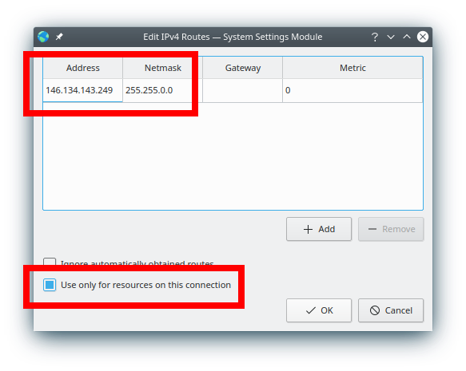

# Environment setup

This page shows a simple step-by-step, starting from scratch, to configure a basic and functional JupyterLab (JLab) environment for use on the local machine (PC or laptop) and LNCC Santos Dumont (SDumont) supercomputer. The article is not intended to be complete, it is a simple script that I use to work on SDumont. For this setup I'm using a laptop with VirtualBox installed and a virtual machine running Kubuntu 20.04. In this text the terms "virtual machine" and "local machine" are used interchangeably, meaning the same thing. What will be seen next is:

- Installing the Anaconda distribution on the local machine, and running JLab
- VPN configuration for accessing the SDumont, using the system's network manager
- Configuring SSH to use key instead of password, and also using the ControlMaster feature that keeps the connection alive
- Configure the conda environment, and install the Syncthing (SThing) package
- Configure SThing to keep directories synchronized between machines
- Run JLab on both local and SDumont machines.

## Anaconda install

Let's start by installing the Anaconda distribution on the local machine, and for that we are going to download it, and this can be done either through the browser or the CLI:

Download and install (CLI):

    $ cd Downloads/
    $ wget https://repo.anaconda.com/archive/Anaconda3-2021.11-Linux-x86_64.sh
    $ sh chmod +x Anaconda3-2021.11-Linux-x86_64.sh
    $ bash Anaconda3-2021.11-Linux-x86_64.sh -b

  
  

Running JupyterLab to check if it's already working (the web browser will run automatically and the JLab will appear):

    $ source ~/anaconda3/etc/profile.d/conda.sh
    $ conda activate
    $ jupyter-lab --NotebookApp.token=''

At this point the Anaconda distribution is installed and JupyterLab is running on the local machine. 

## VPN setup

Let's now configure the network manager to access the SDdumont VPN. The steps to be followed are contained in the detailed information provided by the LNCC, and only part of it is reproduced here. The following text assumes that you already have an SDdumont account.

We will need the network-manager-vpnc:

    $ sudo apt install network-manager-vpnc

After that, enter the Network Manager, Configure Network Connections, add a connection, and chose Cisco Compatible VPN (vpnc):

The following screen must be completed according to the instructions provided by the LNCC:

Let's configure the route so that the normal internet from the local machine continues to work:

Insert (+ Add) the Address 146.134.143.249, Netmask (accept the default), select "Use only for resources on this connection", and save the connection (OK):

 

Then, through the network manager, make the connection, and it should appear connected:

## SSH setup

The next step is to configure SSH to use keys and not passwords, and the steps include creating the key and copying it to the SDdumont user area. 

The `~/.ssh/config` file on the local machine would look like this:

    ...
    
    ServerAliveInterval 120
    Host sd
            HostName login.sdumont.lncc.br
            User <username>
            ControlMaster auto
            ControlPath ~/.ssh/remote_sd

    ...

The `<username>` needs to be replaced with the username. The option called ControlMaster allows sharing of multiple sessions on a single network connection, so when connecting to the cluster (using `ssh -Nf sd`) the connection is active, and all subsequent ssh sessions (including svn, rsync , etc. ) do not need authentication. At the end of use, it is necessary to end the connection with the command `ssh -O exit sd`. Note that the `<username>` is the username being used on the machine, and will vary from case to case.

Creating the key:

    $ ssh-keygen -t ed25519
    Generating public/private ed25519 key pair.
    Enter file in which to save the key (/home/<username>/.ssh/id_ed25519): 
    Created directory '/home/<username>/.ssh'.
    Enter passphrase (empty for no passphrase): 
    Enter same passphrase again: 
    Your identification has been saved in /home/<username>/.ssh/id_ed25519
    Your public key has been saved in /home/<username>/.ssh/id_ed25519.pub
    The key fingerprint is:
    SHA256:+yk+H(...)/0AuM x@vm001
    The key's randomart image is:
    +--[ED25519 256]--+
    |   . . .         |
    |  . o + .        |
    | . + + + o       |
    |o.. * . + o      |
    |o. o . ESo .     |
    |.o  .    ...     |
    |o o     o o      |
    |.=.o ..o+* o     |
    |ooO+.o=BO**      |
    +----[SHA256]-----+

Copy the SSH key to the user area on the SDdumont:

    $ ssh-copy-id <username>@login.sdumont.lncc.br
    /usr/bin/ssh-copy-id: INFO: Source of key(s) to be installed: "/home/<username>/.ssh/id_ed25519.pub"
    The authenticity of host 'login.sdumont.lncc.br (146.134.143.249)' can't be established.
    ECDSA key fingerprint is SHA256:FZQP(...)JnyI.
    Are you sure you want to continue connecting (yes/no/[fingerprint])? yes
    /usr/bin/ssh-copy-id: INFO: attempting to log in with the new key(s), to filter out any that are already installed
    /usr/bin/ssh-copy-id: INFO: 1 key(s) remain to be installed -- if you are prompted now it is to install the new keys
    <username>@login.sdumont.lncc.br's password: 

    Number of key(s) added: 1

    Now try logging into the machine, with:   "ssh '<username>@login.sdumont.lncc.br'"
    and check to make sure that only the key(s) you wanted were added.

At this point, if everything was configured correctly, it is already possible to access without password:

    $ ssh sd
    Last login: Thu Apr  7 18:32:18 2022 from 146.134.223.189
    ________________________________________________________________
      _____ _____                              _   
     / ____|  __ \                            | |  
     | (___| |  | |_   _ _ __ ___   ___  _ __ | |_ 
     \___ \| |  | | | | | '_ ` _ \ / _ \| '_ \| __|
     ____) | |__| | |_| | | | | | | (_) | | | | |_ 
    |_____/|_____/ \__,_|_| |_| |_|\___/|_| |_|\__|
                                                    
    _________________________________________________________________

    Manual: http://sdumont.lncc.br/support_manual.php
    _________________________________________________________________
    The available softwares can be listed with the command: module avail
    If there's something missing, please get in contact with helpdesk-sdumont@lncc.br
    _________________________________________________________________

    O termo de uso do Supercomputador SDdumont foi atualizado em 10/10/2019.
    Ao continuar você concorda com todos os termos descritos nele.

    Termo de uso: http://sdumont.lncc.br/terms.php
    _________________________________________________________________
    [<username>@sdumont13 ~]$

## Conda environment

The next step now is to configure a Conda Environment (CE) to be used on the SDdumont. SDdumont already has some versions of the Anaconda distribution installed, selectable via the `module` command, and we will use the most current one (2020.11):

    $ module avail -t 2>&1 | grep -i Anaconda
    anaconda2/2018.12
    anaconda2/2019.10
    anaconda3/2018.12
    anaconda3/2020.11
    $ module load anaconda3
    $ conda list anaconda$
    # packages in environment at /scratch/app/anaconda3/2020.11:
    #
    # Name                    Version                   Build  Channel
    anaconda                  2020.11                  py38_0  

Let's create an empty conda environment in the user area and activate it nested with the existing environment, so we can install any missing packages. The new conda environment will be created in the scratch/ area so that programs running on the execution nodes can access it.

    $ conda create --prefix /scratch${HOME#/prj}/env01
    Collecting package metadata (current_repodata.json): done
    Solving environment: done

    ==> WARNING: A newer version of conda exists. <==
    current version: 4.9.2
    latest version: 4.12.0

    Please update conda by running

        $ conda update -n base -c defaults conda

    ## Package Plan ##

    environment location: /scratch/<project>/<username>/env01

    Proceed ([y]/n)? 

    Preparing transaction: done
    Verifying transaction: done
    Executing transaction: done
    #
    # To activate this environment, use
    #
    #     $ conda activate /scratch/<project>/<username>/env01
    #
    # To deactivate an active environment, use
    #
    #     $ conda deactivate

And to activate and access the nested environment, we first configure the shell:

    $ source /scratch/app/anaconda3/2020.11/etc/profile.d/conda.sh

And then we activate the nested environment:

    $ conda activate --stack /scratch${HOME#/prj}/env01

Now we can update or install missing packages.

## SThing setup

The purpose of `syncthing` (SThing) is to have a directory automatically synchronized between the local machine and SDdumont, so we don't have to remember to copy files from one machine to another, everything is done automatically. SThing also works similarly to JLab, with client/server architecture and web interface. The SThing needs to be installed on both the local machine and the SDdumont, and this can be done using `conda`. Let's start with the SDdumont, assuming the nested conda environment is already active:

    $ conda install -c conda-forge syncthing
    Collecting package metadata (current_repodata.json): done
    Solving environment: done

    ==> WARNING: A newer version of conda exists. <==
    current version: 4.9.2
    latest version: 4.12.0

    Please update conda by running

        $ conda update -n base -c defaults conda

    ## Package Plan ##

    environment location: /scratch/<project>/<username>/env01

    added / updated specs:
        - syncthing

    The following packages will be downloaded:

        package                    |            build
        ---------------------------|-----------------
        syncthing-1.19.2           |       ha8f183a_0         8.2 MB  conda-forge
        ------------------------------------------------------------
                                            Total:         8.2 MB

    The following NEW packages will be INSThingALLED:

    syncthing          conda-forge/linux-64::syncthing-1.19.2-ha8f183a_0

    Proceed ([y]/n)? 

    Downloading and Extracting Packages
    syncthing-1.19.2     | 8.2 MB    | ############################################# | 100% 
    Preparing transaction: done
    Verifying transaction: done
    Executing transaction: done

Let's do the same on the local machine, but in this case assuming the conda environment is not active yet:

    x@vm001:~$ source ~/anaconda3/etc/profile.d/conda.sh
    x@vm001:~$ conda activate
    (base) x@vm001:~$ conda install -c conda-forge syncthing
    Collecting package metadata (current_repodata.json): done
    Solving environment: done

    ==> WARNING: A newer version of conda exists. <==
    current version: 4.10.3
    latest version: 4.12.0

    Please update conda by running

        $ conda update -n base -c defaults conda

    ## Package Plan ##

    environment location: /home/<username>/anaconda3

    added / updated specs:
        - syncthing

    The following packages will be downloaded:

        package                    |            build
        ---------------------------|-----------------
        conda-4.12.0               |   py39hf3d152e_0        1014 KB  conda-forge
        python_abi-3.9             |           2_cp39           4 KB  conda-forge
        syncthing-1.19.2           |       ha8f183a_0         8.2 MB  conda-forge
        ------------------------------------------------------------
                                            Total:         9.2 MB

    The following NEW packages will be INSThingALLED:

    python_abi         conda-forge/linux-64::python_abi-3.9-2_cp39
    syncthing          conda-forge/linux-64::syncthing-1.19.2-ha8f183a_0

    The following packages will be UPDATED:

    conda              pkgs/main::conda-4.10.3-py39h06a4308_0 --> conda-forge::conda-4.12.0-py39hf3d152e_0

    Proceed ([y]/n)? 

    Downloading and Extracting Packages
    conda-4.12.0         | 1014 KB   | ############################################# | 100% 
    syncthing-1.19.2     | 8.2 MB    | ############################################# | 100% 
    python_abi-3.9       | 4 KB      | ############################################# | 100% 
    Preparing transaction: done
    Verifying transaction: done
    Executing transaction: done

## JLab on the local machine

At this point the basic configuration is done and we can finally get into JLab. Let's first do this on the local machine:

    $ source ~/anaconda3/etc/profile.d/conda.sh
    $ conda activate
    $ syncthing --no-browser --gui-address=0.0.0.0:8384 > ~/8384.log 2>&1 &
    $ cd ~/Sync
    $ jupyter-lab --no-browser --ip=0.0.0.0 --NotebookApp.token="" --port=8888 > ~/8888.log 2>&1 &

The `--no-browser` option means do not automatically run the web browser, `--gui-address` chooses external access and port number. For JLab, `--ip=0.0.0.0` allows access from another machine, `--NotebookApp.token=""` allows use without security token, `--port=8888` sets the port to use, `8888.log` is the log file, and `&` makes the server run in the background (to stop it: `killall jupyter-lab`).

The first time SThing is run, it automatically creates the `~/Sync` directory. We enter this directory, configure the environment and run the JLab server. Note that the use of `--NotebookApp.token=""` should be avoided for security reasons, but its correct use is beyond the scope of this introduction. 

When running the web browser and typing the addresses `http://localhost:8888` and `http://localhost:8384` in two different tabs, the result should be:

Basically what we did was four things (in sequence):

- Configure the CE
- Run SThing server
- Enter the working directory
- Run JLab server

The SThing should show:

Enter the `Actions` menu choose `Show ID` and write down the ID to use later.

From this point on, most tasks can be done within JLab as it has a file browser, terminal, notebook, text editor, table of contents, pdf viewer, etc. Note that there are several possible ways to use JLab, and I'm only using one of them. To access the SDumont we will use the JLab, the only thing that will be done "outside" will be the VPN connection that will be made using the system's network manager.

## JLab on the SDumont

To access SDumont we will choose two random ports, one for JLab (35655), and another for SThing (28863). First we activate VPN in the system's network manager, then using a notebook in JLab, first we activate the SSH connection, then already in the login node we activate CE, then SThing, enter the working directory (~/Sync), run the JLab server, and finally, on the local machine, we create the two tunnels to access the JLab and SThing that are running on SDumont. The commands below are running inside a [notebook cell in JLab](http://github.com/efurlanm/msc22/blob/main/docs/Notebooks/connect.ipynb) on the local machine:

    %%bash
    ssh -Nf sd
    ssh -T sd <<'EOF'
    hostname
    module load anaconda3
    source /scratch/app/anaconda3/2020.11/etc/profile.d/conda.sh
    conda activate --stack /scratch${HOME#/prj}/env01
    syncthing --no-browser --gui-address=0.0.0.0:28863 > ~/28863.log 2>&1 &
    cd ~/Sync
    jupyter-lab --no-browser --port=35655 --ip=0.0.0.0 --NotebookApp.token="" > ~/35655.log 2>&1 &
    EOF
    ssh -NfTL 8385:localhost:28863 sd
    ssh -NfTL 8889:localhost:35655 sd

And the result is shown below, the first two tabs are referring to the local machine, and the last two are JLab and SThing running on SDumont. The JLab tab running on SDumont may take a while to appear:

JLab running on SDdumont:

SThing running on SDdumont:

In this example above, we have the servers running with the interface being accessed in the web browser on the local machine at the addresses:

| server | local machine | SDumont |
| --- | --- | --- |
| JLab | localhost:8888 | localhost:8889 |
| SThing | localhost:8384 | localhost:8385 |

The next step now is to sync the `~/Sync` directories. To do this, in SThing, we click on *+ Add Remote Device* and enter the ID that we had previously noted:

On the other machine a warning appears, just add the device:

Repeat adding device on the other machine:

Add the folder:

Repeat on the other machine:

To not have to keep adding directories, one option is to configure it to add automatically:

Once the SThing is configured, when creating or modifying a file on one machine, the other is automatically updated. In the picture below, on the left side is a browser window showing the JLab running on the local machine editing a notebook [connect.ipynb](http://github.com/efurlanm/msc22/blob/main/docs/Notebooks/connect.ipynb), and on the right side window the same file is shown on the JLab running on SDdumont:

The notebook file "connect.ipynb" is available at: <http://github.com/efurlanm/msc22/blob/main/docs/Notebooks/connect.ipynb>

## Conclusion

In this page we saw how to configure and run the JLab environment on the SDumont computer, starting from scratch. In the end we were left with two JLab servers running, one on a local machine, the other on SDumont, and their web interfaces were accessible in two web browser windows on the local machine. Additionally the SThing file synchronization tool has been configured to work together with JLab.
